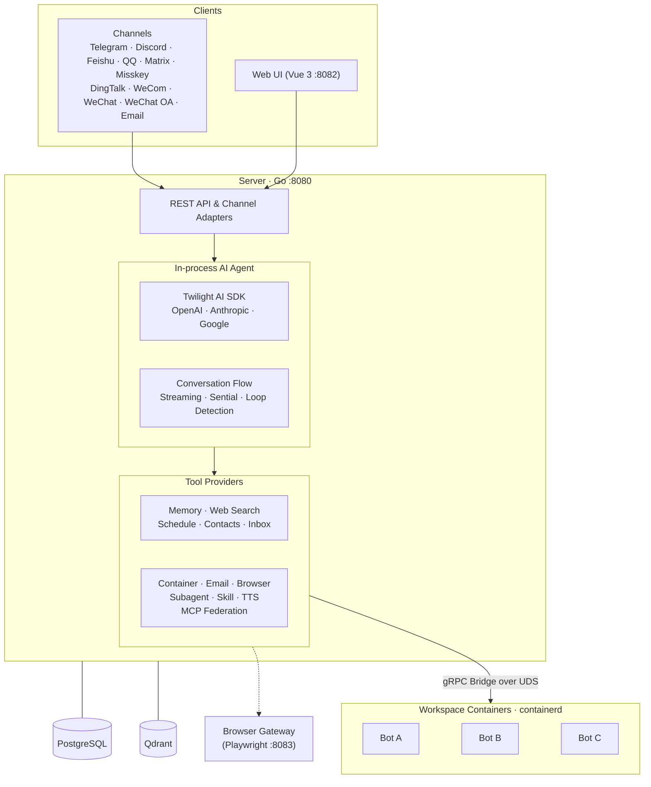

<div align="right">
  <span>[<a href="./README.md">English</a>]<span>
  </span>[<a href="./README_CN.md">简体中文</a>]</span>
</div>  

<div align="center">
  
  <h1>Memoh</h1>
  <p>Self hosted, always-on AI agent platform run in containers.</p>
  <div align="center">
    
    
    
    
    
    
    <a href="https://deepwiki.com/memohai/Memoh">
      
    </a>
    
  </div>
  <div align="center">
    [<a href="https://t.me/memohai">Telegram Group</a>]
    [<a href="https://docs.memoh.ai">Documentation</a>]
    [<a href="mailto:business@memoh.net">Cooperation</a>]
  </div>
</div>

Memoh is an always-on, containerized AI agent system. Create multiple AI bots, each running in its own isolated container with persistent memory, and interact with them across Telegram, Discord, Lark (Feishu), QQ, Matrix, Misskey, DingTalk, WeCom, WeChat, WeChat Official Account, Email, or the built-in Web UI. Bots can execute commands, edit files, browse the web, call external tools via MCP, and remember everything — like giving each bot its own computer and brain.

## Quick Start

One-click install (**requires [Docker](https://www.docker.com/get-started/)**):

```bash
curl -fsSL https://memoh.sh | sh
```

*Silent install with all defaults: `curl -fsSL ... | sh -s -- -y`*

Or manually:

```bash
git clone --depth 1 https://github.com/memohai/Memoh.git
cd Memoh
cp conf/app.docker.toml config.toml
# Edit config.toml
docker compose up -d
```

> **Install a specific version:**
> ```bash
> curl -fsSL https://memoh.sh | MEMOH_VERSION=v0.6.0 sh
> ```
>
> **Use CN mirror for slow image pulls:**
> ```bash
> curl -fsSL https://memoh.sh | USE_CN_MIRROR=true sh
> ```
>
> Do not run the whole installer with `sudo`. The installer will use `sudo docker`
> internally if Docker requires it. On macOS or if your user is in the `docker`
> group, `sudo` is not required for Docker either.

Visit <http://localhost:8082> after startup. Default login: `admin` / `admin123`

See [DEPLOYMENT.md](DEPLOYMENT.md) for custom configuration and production setup.

Documentation entry points:

- [About Memoh](https://docs.memoh.ai/about)
- [Providers & Models](https://docs.memoh.ai/getting-started/provider-and-model)
- [Bot Setup](https://docs.memoh.ai/getting-started/bot)
- [Sessions & Discuss Mode](https://docs.memoh.ai/getting-started/sessions)
- [Channels](https://docs.memoh.ai/getting-started/channels)
- [Skills](https://docs.memoh.ai/getting-started/skills)
- [Supermarket](https://docs.memoh.ai/getting-started/supermarket)
- [Slash Commands](https://docs.memoh.ai/getting-started/slash-commands)

## Why Memoh?

Memoh is built for **always-on continuity** — an AI that stays online, and a memory that stays yours.

- **Lightweight & Fast**: Built with Go as home/studio infrastructure, runs efficiently on edge devices.
- **Containerized by default**: Each bot gets an isolated container with its own filesystem, network, and tools.
- **Hybrid split**: Cloud inference for frontier model capability, local-first memory and indexing for privacy.
- **Multi-user first**: Explicit sharing and privacy boundaries across users and bots.
- **Full graphical configuration**: Configure bots, channels, MCP, skills, and all settings through a modern web UI — no coding required.

## Features

### Core

- 🤖 **Multi-Bot & Multi-User**: Create multiple bots that chat privately, in groups, or with each other. Bots distinguish individual users in group chats, remember each person's context, and support cross-platform identity binding.
- 📦 **Containerized**: Each bot runs in its own isolated containerd container with a dedicated filesystem and network — like having its own computer. Supports snapshots, data export/import, and versioning.
- 🧠 **Memory Engineering**: LLM-driven fact extraction, hybrid retrieval (dense + sparse + BM25), provider-based long-term memory, memory compaction, and separate session-level context compaction. Pluggable backends: Built-in (off / sparse / dense), [Mem0](https://mem0.ai), OpenViking.
- 💬 **Broad Channel Coverage**: Telegram, Discord, Lark (Feishu), QQ, Matrix, Misskey, DingTalk, WeCom, WeChat, WeChat Official Account, Email (Mailgun / SMTP / Gmail OAuth), and built-in Web UI.

### Agent Capabilities

- 🔧 **MCP (Model Context Protocol)**: Full MCP support (HTTP / SSE / Stdio / OAuth). Connect external tool servers for extensibility; each bot manages its own independent MCP connections.
- 🌐 **Browser Automation**: Headless Chromium/Firefox via Playwright — navigate, click, fill forms, screenshot, read accessibility trees, manage tabs.
- 🎭 **Skills, Supermarket & Subagents**: Define bot behavior through modular skills, install curated skills and MCP templates from Supermarket, and delegate complex tasks to sub-agents with independent context.
- 💭 **Sessions & Discuss Mode**: Use chat, discuss, schedule, heartbeat, and subagent sessions with slash-command control and session status inspection.
- ⏰ **Automation**: Cron-based scheduled tasks and periodic heartbeat for autonomous bot activity.

### Management

- 🖥️ **Web UI**: Modern dashboard (Vue 3 + Tailwind CSS) — streaming chat, tool call visualization, file manager, visual configuration for all settings. Dark/light theme, i18n.
- 🔐 **Access Control**: Priority-based ACL rules with presets, allow/deny effects, and scope by channel identity, channel type, or conversation.
- 🧪 **Multi-Model**: OpenAI-compatible, Anthropic, Google, OpenAI Codex, GitHub Copilot, and Edge TTS providers. Per-bot model assignment, provider OAuth, and automatic model import.
- 🚀 **One-Click Deploy**: Docker Compose with automatic migration, containerd setup, and CNI networking.

## Memory System

Memoh's memory system is built around **Memory Providers** — pluggable backends that control how a bot stores, retrieves, and manages long-term memory.

| Provider | Description |
|----------|-------------|
| **Built-in** | Self-hosted, ships with Memoh. Three modes: **Off** (file-based, no vector search), **Sparse** (neural sparse vectors via local model, no API cost), **Dense** (embedding-based semantic search via Qdrant). |
| **Mem0** | SaaS memory via the [Mem0](https://mem0.ai) API. |
| **OpenViking** | Self-hosted or SaaS memory with its own API. |

Each bot binds one provider. During chat, the bot automatically extracts key facts from every conversation turn and stores them as structured memories. On each new message, the most relevant memories are retrieved via hybrid search and injected into the bot's context — giving it personalized, long-term recall across conversations.

Additional capabilities include memory compaction (merge redundant entries), rebuild, manual creation/editing, and vector manifold visualization (Top-K distribution & CDF curves). See the [documentation](https://docs.memoh.ai/memory-providers/) for setup details.

## Gallery

<table>
  <tr>
    <td></td>
    <td></td>
    <td></td>
  </tr>
  <tr>
    <td><strong text-align="center">Chat</strong></td>
    <td><strong text-align="center">Container</strong></td>
    <td><strong text-align="center">Providers</strong></td>
  </tr>
  <tr>
    <td></td>
    <td></td>
    <td></td>
  </tr>
  <tr>
    <td><strong text-align="center">File Manager</strong></td>
    <td><strong text-align="center">Scheduled Tasks</strong></td>
    <td><strong text-align="center">Token Usage</strong></td>
  </tr>
</table>

## Architecture



## Sub-projects Born for This Project

- [**Twilight AI**](https://github.com/memohai/twilight-ai) — A lightweight, idiomatic AI SDK for Go — inspired by [Vercel AI SDK](https://sdk.vercel.ai/). Provider-agnostic (OpenAI, Anthropic, Google), with first-class streaming, tool calling, MCP support, and embeddings.

## Roadmap

Please refer to the [Roadmap](https://github.com/memohai/Memoh/issues/86) for more details.

## Development

Refer to [CONTRIBUTING.md](CONTRIBUTING.md) for development setup.

## Star History

[](https://www.star-history.com/#memohai/Memoh&type=date&legend=top-left)

## Contributors

<a href="https://github.com/memohai/Memoh/graphs/contributors">
  
</a>

**LICENSE**: AGPLv3

Copyright (C) 2026 Memoh. All rights reserved.
