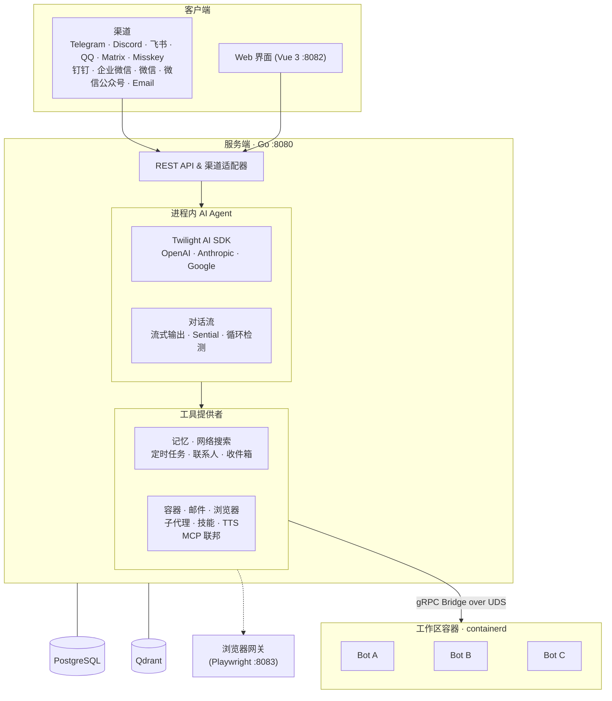

<div align="right">
  <span>[<a href="./README.md">English</a>]<span>
  </span>[<a href="./README_CN.md">简体中文</a>]</span>
</div>  

<div align="center">
  
  <h1>Memoh</h1>
  <div align="center">
    
    
    
    
    
    
    <a href="https://deepwiki.com/memohai/Memoh">
      
    </a>
    
  </div>
  <div align="center">
    [<a href="https://t.me/memohai">Telegram 群组</a>]
    [<a href="https://docs.memoh.ai">文档</a>]
    [<a href="mailto:business@memoh.net">合作</a>]
  </div>
  <hr>
</div>

Memoh 是一个常驻运行的容器化 AI Agent 系统。你可以创建多个 AI 机器人，每个机器人运行在独立的容器中，拥有持久化记忆，并通过 Telegram、Discord、飞书(Lark)、QQ、Matrix、Misskey、钉钉、企业微信、微信、微信公众号、Email 或内置 Web 界面与之交互。机器人可以执行命令、编辑文件、浏览网页、通过 MCP 调用外部工具，并记住一切 —— 就像给每个 Bot 一台自己的电脑和大脑。

## 快速开始

一键安装（**需先安装 [Docker](https://www.docker.com/get-started/)**）：

```bash
curl -fsSL https://memoh.sh | sh
```

*静默安装（全部默认）：`curl -fsSL ... | sh -s -- -y`*

或手动部署：

```bash
git clone --depth 1 https://github.com/memohai/Memoh.git
cd Memoh
cp conf/app.docker.toml config.toml
# 编辑 config.toml
docker compose up -d
```

> **安装指定版本：**
> ```bash
> curl -fsSL https://memoh.sh | MEMOH_VERSION=v0.6.0 sh
> ```
>
> **使用中国大陆镜像加速：**
> ```bash
> curl -fsSL https://memoh.sh | USE_CN_MIRROR=true sh
> ```
>
> 不要用 `sudo` 运行整个安装脚本。脚本会在 Docker 需要时只对
> `docker` 命令使用 `sudo`。macOS 或用户已在 `docker` 用户组中时，
> Docker 命令通常也无需 `sudo`。

启动后访问 <http://localhost:8082>。默认登录：`admin` / `admin123`

自定义配置与生产部署请参阅 [DEPLOYMENT.md](DEPLOYMENT.md)。

文档入口：

- [产品概览](https://docs.memoh.ai/about)
- [Providers & Models](https://docs.memoh.ai/getting-started/provider-and-model)
- [Bot 配置](https://docs.memoh.ai/getting-started/bot)
- [Sessions / Discuss 模式](https://docs.memoh.ai/getting-started/sessions)
- [Channels 渠道接入](https://docs.memoh.ai/getting-started/channels)
- [Skills](https://docs.memoh.ai/getting-started/skills)
- [Supermarket](https://docs.memoh.ai/getting-started/supermarket)
- [Slash Commands](https://docs.memoh.ai/getting-started/slash-commands)

## 为什么选择 Memoh？

Memoh 为**常驻连续运行**而生 —— 一个始终在线的 AI，一份属于你自己的记忆。

- **轻量高效**：Go 语言构建，可作为家庭/工作室基础设施，在边缘设备上高效运行。
- **默认容器化**：每个 Bot 拥有独立容器，包含专属文件系统、网络和工具。
- **混合架构**：云端推理获取前沿模型能力，本地记忆和索引保障隐私。
- **多用户优先**：用户与 Bot 之间具有明确的共享和隐私边界。
- **全图形化配置**：通过现代 Web 界面配置 Bot、渠道、MCP、技能等所有设置，无需编写代码。

## 特性

### 核心

- 🤖 **多 Bot 与多用户**：创建多个 Bot，支持私聊、群聊或 Bot 间协作。Bot 可在群聊中区分不同用户，分别记忆上下文，并支持跨平台身份绑定。
- 📦 **容器化**：每个 Bot 运行在独立的 containerd 容器中，拥有专属文件系统和网络，宛如各自拥有一台电脑。支持快照、数据导入/导出与版本管理。
- 🧠 **记忆工程**：LLM 驱动的知识抽取，混合检索（稠密 + 稀疏 + BM25），基于 Provider 的长期记忆、记忆压缩，以及独立的会话上下文压缩。可插拔后端：内置（off / sparse / dense）、[Mem0](https://mem0.ai)、OpenViking。
- 💬 **广泛渠道接入**：Telegram、Discord、飞书(Lark)、QQ、Matrix、Misskey、钉钉、企业微信、微信、微信公众号、Email（Mailgun / SMTP / Gmail OAuth）及内置 Web 界面。

### Agent 能力

- 🔧 **MCP（模型上下文协议）**：完整 MCP 支持（HTTP / SSE / Stdio / OAuth）。连接外部工具服务器进行扩展，每个 Bot 独立管理自己的 MCP 连接。
- 🌐 **浏览器自动化**：基于 Playwright 的无头 Chromium/Firefox —— 页面导航、点击、填写表单、截图、读取无障碍树、多标签页管理。
- 🎭 **技能、Supermarket 与子代理**：通过模块化技能文件定义 Bot 行为；从 Supermarket 安装精选技能和 MCP 模板；将复杂任务委派给拥有独立上下文的子代理。
- 💭 **会话与 Discuss 模式**：支持 chat、discuss、schedule、heartbeat、subagent 等会话类型，并可通过 slash commands 管理。
- ⏰ **自动化**：基于 Cron 的定时任务和周期性心跳，实现 Bot 自主活动。

### 管理

- 🖥️ **Web 界面**：基于 Vue 3 + Tailwind CSS 的现代面板 —— 流式聊天、工具调用可视化、文件管理器、所有配置可视化操作。深色/浅色主题，中英文支持。
- 🔐 **访问控制**：基于优先级的 ACL 规则与 preset，支持 allow/deny 效果，可按渠道身份、渠道类型或会话维度控制。
- 🧪 **多模型**：支持 OpenAI 兼容、Anthropic、Google、OpenAI Codex、GitHub Copilot、Edge TTS 等提供商。每个 Bot 独立配置模型，支持 Provider OAuth 和自动模型导入。
- 🚀 **一键部署**：Docker Compose 编排，自动迁移、containerd 初始化与 CNI 网络配置。

## 记忆系统

Memoh 的记忆系统围绕 **Memory Provider（记忆供应商）** 构建 —— 可插拔的后端，控制 Bot 如何存储、检索和管理长期记忆。

| 供应商 | 说明 |
|--------|------|
| **Built-in（内置）** | 自托管，随 Memoh 附带。三种模式：**Off**（文件索引，无向量搜索）、**Sparse**（本地神经稀疏向量模型，无 API 费用）、**Dense**（基于嵌入模型的语义搜索，需 Qdrant）。 |
| **Mem0** | 通过 [Mem0](https://mem0.ai) API 的 SaaS 记忆服务。 |
| **OpenViking** | 自托管或 SaaS 记忆服务，使用自有 API。 |

每个 Bot 绑定一个供应商。聊天过程中，Bot 自动从每轮对话中抽取关键事实并存储为结构化记忆。收到新消息时，系统通过混合检索找到最相关的记忆并注入 Bot 上下文 —— 实现跨对话的个性化长期记忆。

其他功能包括记忆压缩（合并冗余条目）、重建、手动创建/编辑，以及向量流形可视化（Top-K 分布与 CDF 曲线）。详见[文档](https://docs.memoh.ai/memory-providers/)。

## 图库

<table>
  <tr>
    <td></td>
    <td></td>
    <td></td>
  </tr>
  <tr>
    <td><strong text-align="center">与 Bot 聊天</strong></td>
    <td><strong text-align="center">容器与 Bot 管理</strong></td>
    <td><strong text-align="center">提供商与模型配置</strong></td>
  </tr>
  <tr>
    <td></td>
    <td></td>
    <td></td>
  </tr>
  <tr>
    <td><strong text-align="center">容器文件管理器</strong></td>
    <td><strong text-align="center">定时任务</strong></td>
    <td><strong text-align="center">Token 用量追踪</strong></td>
  </tr>
</table>

## 架构



## 因本项目而诞生的子项目

- [**Twilight AI**](https://github.com/memohai/twilight-ai) — 轻量、地道的 Go AI SDK —— 灵感源自 [Vercel AI SDK](https://sdk.vercel.ai/)。支持多供应商（OpenAI、Anthropic、Google），提供一流的流式输出、工具调用、MCP 支持与嵌入向量生成。

## 路线图

详见 [Roadmap](https://github.com/memohai/Memoh/issues/86)。

## 开发

开发环境配置请参阅 [CONTRIBUTING.md](CONTRIBUTING.md)。

## Star History

[](https://www.star-history.com/#memohai/Memoh&type=date&legend=top-left)

## Contributors

<a href="https://github.com/memohai/Memoh/graphs/contributors">
  
</a>

**LICENSE**: AGPLv3

Copyright (C) 2026 Memoh. All rights reserved.
